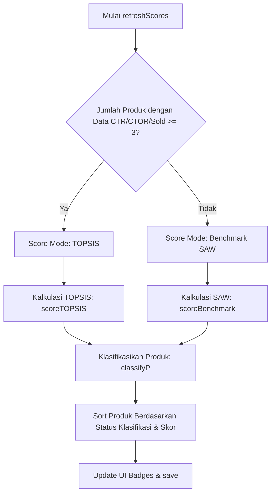

# SYSTEM_MAP.md — AffiliateOS Navigation Map

Dokumen ini berfungsi sebagai navigasi utama, peta modul, dan penjelas logika dasar untuk file tunggal **AffiliateOS** (`index.html`). Dirancang untuk mempermudah pemahaman arsitektur dan pengembangan lanjutan.

---

## 1. Project Summary

* **Tujuan Aplikasi**: 
  Aplikasi SPA (*Single Page Application*) desktop tanpa backend untuk membantu kreator afiliasi TikTok Shop memantau analitik performa konten, mengelola master produk, menyusun jadwal posting otomatis secara strategis, memelihara bank materi video (Hook/Proof/CTA), serta memformulasikan naskah video kreatif memanfaatkan integrasi Gemini API.
* **Tech Stack**:
  * **Core**: HTML5, Vanilla JavaScript, CSS Modern (dengan variabel tema gelap, glassmorphism, dan animasi mikro).
  * **CDN Libraries**:
    * **SheetJS (XLSX.js)** ([index.html:L7](file:///Users/mhmdrzki/Documents/affiliate-manajemen/index.html#L7)): Digunakan untuk memproses file laporan analitik TikTok dalam format Excel (`.xlsx`/`.xls`) atau `.csv` secara lokal di browser.
    * **Google Identity Services (GIS)** ([index.html:L8](file:///Users/mhmdrzki/Documents/affiliate-manajemen/index.html#L8)): Client OAuth2 untuk proses autentikasi akun Google Drive pengguna.
  * **Storage (Local)**:
    * `localStorage` key `affos4`: Menyimpan database utama aplikasi (`S` state).
    * `localStorage` key `affos_gd`: Menyimpan token otorisasi (`token`) dan file ID Google Drive (`fileId`).
    * `localStorage` key `gemini_api_key`: Menyimpan custom Gemini API Key pengguna.
  * **AI Integration**: Pemanggilan API langsung ke Google Gemini API (`https://generativelanguage.googleapis.com/v1beta/models/<model>:generateContent`). Mendukung kustomisasi API Key secara lokal (`localStorage`), dan **pemilihan model** (`gemini-2.5-flash`, `gemini-3.0-flash`, `gemini-2.0-flash`) dari UI Sidebar untuk resolusi deprecation / _Rate Limit_ (429) pada akun gratisan.
  * **Typography**: `@import` Google Fonts (`Raleway`, `DM Sans`, `IBM Plex Mono`) ([index.html:L10](file:///Users/mhmdrzki/Documents/affiliate-manajemen/index.html#L10)).
* **Pola Arsitektur**:
  * **SPA Modular**: Navigasi diatur secara manual oleh fungsi `goPage(id, el)` ([index.html:L909](file:///Users/mhmdrzki/Documents/affiliate-manajemen/index.html#L909)) dengan memicu manipulasi kelas CSS `.act` pada blok halaman dan menu navigasi.
  * **Reactive State Management**: Objek database global tunggal `S` diubah secara langsung di memori, diikuti dengan pemanggilan fungsi pembantu `save()` ([index.html:L879](file:///Users/mhmdrzki/Documents/affiliate-manajemen/index.html#L879)) untuk menyimpan state ke `localStorage` dan menjadwalkan sinkronisasi otomatis ke Google Drive (`gdScheduleSync()`).

---

## 2. Core Logic Flow (Function-Level)

Alur logika utama aplikasi dipetakan sebagai berikut:

### A. Alur Impor Analytics (CSV/XLSX)
$$\text{Drop / Pilih File} \xrightarrow{\text{UI Event}} \text{handleFile(inp)} \rightarrow \text{processFile(file)} \xrightarrow{\text{SheetJS}} \text{importRows(rows)} \xrightarrow{\text{Dedup \& Parse}} \text{Mutasi } S.\text{contents} + S.\text{products} \xrightarrow{\text{save()}} \text{Storage + Drive sync}$$
1. Pengguna me-drop file di zona impor atau memilih secara manual ([index.html:L493](file:///Users/mhmdrzki/Documents/affiliate-manajemen/index.html#L493)).
2. `handleFile(inp)` ([index.html:L1593](file:///Users/mhmdrzki/Documents/affiliate-manajemen/index.html#L1593)) / `ddr(e)` ([index.html:L1592](file:///Users/mhmdrzki/Documents/affiliate-manajemen/index.html#L1592)) menangkap file dan meneruskan ke `processFile(file)` ([index.html:L1597](file:///Users/mhmdrzki/Documents/affiliate-manajemen/index.html#L1597)).
3. File dibaca menggunakan `FileReader` sebagai Array Buffer. Jika berformat CSV, parsing dilewatkan ke `parseCSV()` ([index.html:L1614](file:///Users/mhmdrzki/Documents/affiliate-manajemen/index.html#L1614)). Jika Excel, dibaca lewat parser SheetJS `XLSX.read()` ([index.html:L1605](file:///Users/mhmdrzki/Documents/affiliate-manajemen/index.html#L1605)).
4. `importRows(rows, filename)` ([index.html:L1627](file:///Users/mhmdrzki/Documents/affiliate-manajemen/index.html#L1627)) menyaring baris duplikat (deduplikasi), mengelompokkan kategori produk otomatis berdasarkan kata kunci nama produk, memperbarui metrik kumulatif produk (`totalGMV`, `totalItemsSold`, dsb.), menambahkan riwayat ke `S.importHistory`, dan memanggil `refreshScores()` ([index.html:L1027](file:///Users/mhmdrzki/Documents/affiliate-manajemen/index.html#L1027)) untuk kalkulasi skoring terbaru sebelum melakukan `save()`.

### B. Alur Pembuatan Jadwal Konten (Schedule Generation)
$$\text{Klik Button "Generate"} \xrightarrow{\text{UI Event}} \text{genSched()} \xrightarrow{\text{Fallback logic}} \text{Assign slot produk ke } \text{schedData} \xrightarrow{\text{Render UI}} \text{renderSchedOutput()}$$
1. Pengguna menentukan parameter: tanggal mulai, rentang hari, dan jumlah slot posting per hari ([index.html:L351](file:///Users/mhmdrzki/Documents/affiliate-manajemen/index.html#L351)).
2. Tombol click memicu `genSched()` ([index.html:L1300](file:///Users/mhmdrzki/Documents/affiliate-manajemen/index.html#L1300)).
3. Fungsi mengelompokkan produk master non-`DROP` ke 3 pool peringkat: `winning`, `potential`, dan `monitor`.
4. Berdasarkan jumlah slot per hari yang dipilih, waktu posting dicocokkan dengan konstanta slot `PATS` ([index.html:L902](file:///Users/mhmdrzki/Documents/affiliate-manajemen/index.html#L902)).
5. Slot-slot strategis dibagikan secara cerdas:
   * **Prime Slots** (`16:00/17:00/18:00`) $\rightarrow$ Diisi produk `WINNING`.
   * **Mid Slots** (`09:00/10:00/11:00/13:00/14:00`) $\rightarrow$ Diisi produk `POTENTIAL` (atau fallback ke `WINNING`).
   * **Slot Biasa** $\rightarrow$ Diisi produk `MONITOR` atau pool produk aktif yang tersisa.
6. Algoritma melakukan alokasi indeks hook, proof, dan CTA acak untuk slot tersebut, lalu me-render visualisasi jadwal dengan fungsi `renderSchedOutput()` ([index.html:L1336](file:///Users/mhmdrzki/Documents/affiliate-manajemen/index.html#L1336)).

### C. Alur Pembuatan Script Video (Gemini AI Integration)
$$\text{Form Generator / Master Produk} \xrightarrow{\text{UI Event}} \text{doGenDesc() / genScript()} \xrightarrow{\text{Direct Fetch}} \text{Gemini API (POST)} \xrightarrow{\text{JSON Parse}} \text{Tampilkan / Simpan ke } S.\text{products}[i].\text{descVariants} \xrightarrow{\text{save()}} \text{Storage + Drive sync}$$
1. **Melalui Master Produk**: Tombol `✦ Generate Isi Konten (AI)` memicu modal interaktif via `openGenDesc(pi)` ([index.html:L1184](file:///Users/mhmdrzki/Documents/affiliate-manajemen/index.html#L1184)). Klik proses memanggil `doGenDesc()` ([index.html:L1207](file:///Users/mhmdrzki/Documents/affiliate-manajemen/index.html#L1207)), men-fetch 3 variasi bagian inti script video (body) dari Gemini API (`callGemini()`), lalu menyimpannya langsung ke array `descVariants` produk.
2. **Melalui Standalone Generator**: Klik button `✦ Generate 3 Variasi` memanggil `genScript()` ([index.html:L1490](file:///Users/mhmdrzki/Documents/affiliate-manajemen/index.html#L1490)), mengirim parameter produk ke Gemini API (`callGemini()`) untuk merancang 3 skrip terstruktur utuh (terdiri atas bagian Hook, Isi, Proof, dan CTA). Hasilnya dirender di panel output, di mana pengguna dapat mengklik tombol "Simpan ke Master" yang akan memanggil `saveVarToMaster(varIdx)` ([index.html:L1577](file:///Users/mhmdrzki/Documents/affiliate-manajemen/index.html#L1577)) untuk memindahkan teks body isi ke database produk.

### D. Alur Pemeringkatan & Klasifikasi (Dual Scoring System)
$$\text{Data Trigger (Import / Save)} \rightarrow \text{refreshScores()} \xrightarrow{\text{Auto-Detect Mode}} \begin{cases} \ge 3 \text{ produk berdata} \rightarrow \text{scoreTOPSIS()} \\ < 3 \text{ produk berdata} \rightarrow \text{scoreBenchmark()} \end{cases} \rightarrow \text{classifyP()} \rightarrow \text{Sort \& Badge} \xrightarrow{\text{save()}} \text{Storage + Drive sync}$$
1. Setiap kali terjadi perubahan data, `refreshScores()` ([index.html:L1027](file:///Users/mhmdrzki/Documents/affiliate-manajemen/index.html#L1027)) dieksekusi.
2. Fungsi memeriksa jumlah produk yang memiliki data statistik analitik komersial (CTR > 0, CTOR > 0, atau unit terjual > 0).
3. Jika jumlah produk ber-data $\ge 3$, mode penilaian beralih ke **Personal TOPSIS** (`scoreTOPSIS(ps)`) ([index.html:L963](file:///Users/mhmdrzki/Documents/affiliate-manajemen/index.html#L963)). Jika data masih kurang dari 3, fallback ke mode **Benchmark SAW** (`scoreBenchmark(ps)`) ([index.html:L946](file:///Users/mhmdrzki/Documents/affiliate-manajemen/index.html#L946)).
4. `classifyP(p, mode)` ([index.html:L983](file:///Users/mhmdrzki/Documents/affiliate-manajemen/index.html#L983)) menetapkan kategori performa produk (`WINNING`, `POTENTIAL`, `MONITOR`, `DROP`) berdasarkan skor analitik.
5. Objek dalam `S.products` diurutkan berdasarkan prioritas status klasifikasi kemudian besaran skor, memperbarui status badge navigasi (`updateBadges()`), dan menyimpan perubahan.

### E. Alur Sinkronisasi Google Drive
$$\text{Klik Connect / Data Save} \xrightarrow{\text{Otorisasi / Debounce}} \text{gdConnect() / gdScheduleSync()} \rightarrow \text{gdFindFile()} \rightarrow \begin{cases} \text{Bila load} \rightarrow \text{Download JSON} \rightarrow \text{Merge ke } S \\ \text{Bila save} \rightarrow \text{gdSaveNow()} \rightarrow \text{PATCH / POST JSON ke Drive} \end{cases}$$
1. **Otorisasi**: Pengguna melakukan koneksi via `gdConnect()` ([index.html:L719](file:///Users/mhmdrzki/Documents/affiliate-manajemen/index.html#L719)), meluncurkan Google OAuth2 token client untuk mendapatkan token akses (`gdToken`), lalu menyimpan informasi koneksi.
2. **Sinkronisasi Unduh**: `gdLoadFromDrive()` ([index.html:L759](file:///Users/mhmdrzki/Documents/affiliate-manajemen/index.html#L759)) mencari file `affiliateos_data.json` di `appDataFolder` Google Drive. Jika ditemukan, data diunduh dan menimpa database lokal `S`, diikuti rendering ulang UI. Jika file belum ada di Drive, data lokal dicadangkan ke awan untuk pertama kalinya.
3. **Sinkronisasi Unggah Otomatis (Debounced)**: Setiap kali `save()` dieksekusi di browser, `gdScheduleSync()` ([index.html:L832](file:///Users/mhmdrzki/Documents/affiliate-manajemen/index.html#L832)) dijalankan. Fungsi ini menunda (debounce) eksekusi pengunggahan selama 3 detik. Jika tidak ada perubahan baru dalam jeda tersebut, `gdSaveNow()` ([index.html:L792](file:///Users/mhmdrzki/Documents/affiliate-manajemen/index.html#L792)) mengirimkan pembaruan state JSON menggunakan metode HTTP PATCH (untuk file lama) atau POST multipart (untuk file baru).

---

## 3. Clean Structure

Aplikasi kini telah dimodularisasi menjadi arsitektur multi-file standar untuk performa token AI yang optimal:

```
affiliate-manajemen/
├─ index.html         (~25 KB, Struktur HTML UI Utama)
├─ css/
│  └─ style.css       (Seluruh gaya visual dan tema UI)
├─ js/
│  ├─ 01-gdrive.js    (Google Drive Sync Module)
│  ├─ 02-state.js     (State (S) & Init Bank Defaults, Gemini Auth)
│  ├─ 03-scoring.js   (Dual Scoring System TOPSIS/SAW)
│  ├─ 04-nav.js       (UI Navigation Engine)
│  ├─ 05-dashboard.js (Dashboard View & Anomaly Detect)
│  ├─ 06-produk.js    (Master Produk View & Gemini Script Gen)
│  ├─ 07-jadwal.js    (Jadwal Konten & Slot Planner)
│  └─ 08-views.js     (Hook/Proof/CTA Bank, Script Gen, Import CSV/XLSX, Benchmark)
```

**Urutan Pemuatan (Load Order):**
Karena menggunakan Vanilla JS tanpa bundler, file `.js` diload berurutan (01 sampai 08) di akhir body `index.html` karena fungsi dari file selanjutnya bergantung pada dependensi atau variabel state yang didefinisikan di file sebelumnya.

---

## 4. Module Map (The Chapters)

Berikut penjelasan fungsi-fungsi penting dan event handler utama yang menyusun 8 halaman aplikasi:

### 1. Dashboard Module (`dash`)
* **`renderDash()`** ([index.html:L1060](file:///Users/mhmdrzki/Documents/affiliate-manajemen/index.html#L1060)): Mengambil data analitik historis dari `S.contents` untuk menghitung total GMV, total unit terjual, estimasi komisi, rata-rata CTR, rata-rata CTOR, dan jumlah konten terunggah. Me-render tabel konten yang diurutkan dinamis, memicu fungsi pendeteksi anomali, dan merilis barisan pesan rekomendasi penting kepada kreator.
* **`detectAnomalies(products)`** ([index.html:L1005](file:///Users/mhmdrzki/Documents/affiliate-manajemen/index.html#L1005)): Secara otomatis menganalisis pola anomali produk master, seperti mendeteksi lonjakan tayangan abnormal dengan konversi rendah (indikasi seller mengaktifkan GMV Max), mendeteksi pemenang tersembunyi (*hidden winner*) yang memiliki CTOR sangat tinggi namun jarang diunggah, memantau klaster produk seller aktif iklan, serta memperingatkan jika produk pemenang belum memiliki variasi skrip konten.

### 2. Master Produk Module (`produk`)
* **`renderProduk()`** ([index.html:L1121](file:///Users/mhmdrzki/Documents/affiliate-manajemen/index.html#L1121)): Mengelompokkan seluruh produk master ke dalam 5 filter tab (Semua, Winning, Potential, Monitor, Drop) dan merender list kartu produk.
* **`renderPList(elId, ps)`** ([index.html:L1127](file:///Users/mhmdrzki/Documents/affiliate-manajemen/index.html#L1127)): Me-render detail kartu produk master, visualisasi bar tingkat keunggulan skor (SAW/TOPSIS), rekomendasi slot posting, statistik upload, komisi, label prestasi dari pasar, serta menampilkan tombol aksi variasi konten AI.
* **`openGenDesc(pi)`** & **`doGenDesc()`** ([index.html:L1184](file:///Users/mhmdrzki/Documents/affiliate-manajemen/index.html#L1184), [index.html:L1207](file:///Users/mhmdrzki/Documents/affiliate-manajemen/index.html#L1207)): Menampilkan modal panduan deskripsi produk dan mengeksekusi integrasi Anthropic Claude API untuk merancang hingga 3 variasi ringkasan isi konten produk unik.
* **`editDesc(pi, vi)`** & **`delDesc(pi, vi)`** ([index.html:L1249](file:///Users/mhmdrzki/Documents/affiliate-manajemen/index.html#L1249), [index.html:L1254](file:///Users/mhmdrzki/Documents/affiliate-manajemen/index.html#L1254)): Handler untuk mengedit isi teks variasi konten AI secara manual atau menghapusnya dari database produk.
* **`editProd(pi)`** ([index.html:L1256](file:///Users/mhmdrzki/Documents/affiliate-manajemen/index.html#L1256)): Membuka form edit produk master dan me-load datanya ke modal edit produk master.
* **`delProd(i)`** ([index.html:L1179](file:///Users/mhmdrzki/Documents/affiliate-manajemen/index.html#L1179)): Menghapus produk terpilih dari master produk dan memicu pembaruan peringkat.

### 3. Jadwal Konten Module (`jadwal`)
* **`renderSchedAvail()`** ([index.html:L1272](file:///Users/mhmdrzki/Documents/affiliate-manajemen/index.html#L1272)): Memperbarui dan merender daftar produk aktif non-DROP yang siap dimasukkan ke dalam antrean slot jadwal di panel kiri.
* **`buildSlotScript(prod, hIdx, pfIdx, ctaIdx, descIdx)`** ([index.html:L1290](file:///Users/mhmdrzki/Documents/affiliate-manajemen/index.html#L1290)): Fungsi perakit script video instan di dalam jadwal. Menggabungkan template Hook (dengan menyisipkan nama produk yang sesuai secara dinamis), variasi deskripsi isi konten produk master, template Proof, serta template CTA terpilih.
* **`genSched()`** ([index.html:L1300](file:///Users/mhmdrzki/Documents/affiliate-manajemen/index.html#L1300)): Membuat alur skema jadwal kerja harian berlandaskan prioritas performa produk dan batas durasi slot.
* **`renderSchedOutput()`** ([index.html:L1336](file:///Users/mhmdrzki/Documents/affiliate-manajemen/index.html#L1336)): Me-render daftar jadwal per hari secara visual. Mendukung aksi expand detail slot skrip rekam, rotasi elemen template instan secara acak, penyalinan naskah ke papan klip (*clipboard*), serta penggantian produk slot secara manual.
* **`updSlot(di, si, key, val)`** ([index.html:L1396](file:///Users/mhmdrzki/Documents/affiliate-manajemen/index.html#L1396)): Memperbarui kombinasi komponen skrip (Hook/Proof/CTA) terpilih pada slot jadwal tertentu secara real-time.
* **`rotateSlot(di, si)`** ([index.html:L1402](file:///Users/mhmdrzki/Documents/affiliate-manajemen/index.html#L1402)): Merotasi secara sekuensial komponen-komponen penyusun skrip di slot jadwal bersangkutan untuk memberikan variasi segar.
* **`openAssign(di, si)`** & **`doAssign(pid)`** ([index.html:L1416](file:///Users/mhmdrzki/Documents/affiliate-manajemen/index.html#L1416), [index.html:L1427](file:///Users/mhmdrzki/Documents/affiliate-manajemen/index.html#L1427)): Menampilkan modal pemilihan produk aktif untuk dialokasikan manual ke slot jadwal yang ditentukan.

### 4. Hook · Proof · CTA Bank Module (`bank`)
* **`renderBank()`** ([index.html:L1437](file:///Users/mhmdrzki/Documents/affiliate-manajemen/index.html#L1437)): Memicu render ulang daftar Hook bank, Proof bank, dan CTA bank.
* **`addHook()`**, **`addProof()`**, **`addCTA()`** ([index.html:L1464-1466](file:///Users/mhmdrzki/Documents/affiliate-manajemen/index.html#L1464)): Menyimpan teks template kustom baru buatan pengguna ke dalam state global database masing-masing bank template.
* **`delHook(id)`**, **`delProof(id)`**, **`delCTA(id)`** ([index.html:L1467-1469](file:///Users/mhmdrzki/Documents/affiliate-manajemen/index.html#L1467)): Menghapus template teks terpilih dari state global berdasarkan ID uniknya.

### 5. Script Generator Module (`script`)
* **`fillSGDropdowns()`** ([index.html:L1474](file:///Users/mhmdrzki/Documents/affiliate-manajemen/index.html#L1474)): Mengisi daftar pilihan produk pada generator skrip mandiri dengan daftar produk master aktif.
* **`prefillSG()`** ([index.html:L1478](file:///Users/mhmdrzki/Documents/affiliate-manajemen/index.html#L1478)): Otomatis mengisi kolom arahan dan detail deskripsi di form pembuat skrip ketika pengguna memilih produk master (memuat harga, jumlah penjualan, dan label).
* **`genScript()`** ([index.html:L1490](file:///Users/mhmdrzki/Documents/affiliate-manajemen/index.html#L1490)): Menghubungi Anthropic Claude API untuk menghasilkan 3 variasi script video lengkap (Hook, Isi, Proof, CTA) dalam format JSON berdasarkan parameter gaya visual kamera (OOTD, review jujur, one-take, demo produk) dan batas durasi.
* **`saveVarToMaster(i)`** ([index.html:L1577](file:///Users/mhmdrzki/Documents/affiliate-manajemen/index.html#L1577)): Memindahkan potongan isi skrip terpilih ke database `descVariants` produk master yang ditargetkan (maksimal 3 variasi).

### 6. Import Analytics Module (`import`)
* **`processFile(file)`** ([index.html:L1597](file:///Users/mhmdrzki/Documents/affiliate-manajemen/index.html#L1597)): Handler utama pembacaan file. Mengarahkan file ke parser CSV atau SheetJS XLSX bergantung pada ekstensi file laporan yang dimasukkan.
* **`parseCSV(text)`** ([index.html:L1614](file:///Users/mhmdrzki/Documents/affiliate-manajemen/index.html#L1614)): Parser teks CSV manual untuk memilah kolom, mengabaikan tanda kutip ganda pembungkus, dan mengembalikan array objek baris.
* **`importRows(rows, filename)`** ([index.html:L1627](file:///Users/mhmdrzki/Documents/affiliate-manajemen/index.html#L1627)): Logika pemrosesan impor. Melakukan deduplikasi konten, memetakan produk baru secara otomatis beserta tipenya lewat regex nama produk, mengakumulasikan performa, mencatat riwayat log impor, serta memicu penyusunan ulang skoring produk.
* **`clearAll()`** ([index.html:L1704](file:///Users/mhmdrzki/Documents/affiliate-manajemen/index.html#L1704)): Mereset database state konten, produk, dan log impor secara permanen (menjaga data Hook, Proof, dan CTA default tetap aman).

### 7. Benchmark Module (`bench`)
* **`renderBench()`** ([index.html:L1744](file:///Users/mhmdrzki/Documents/affiliate-manajemen/index.html#L1744)): Me-render visualisasi pola mingguan, jam upload tersibuk, grafik penyebaran hari, serta menampilkan 10 produk andalan referensi sukses akun `bangjie.id`.
* **`copyOneBench(p)`** & **`copyAllBench()`** ([index.html:L1792](file:///Users/mhmdrzki/Documents/affiliate-manajemen/index.html#L1792), [index.html:L1797](file:///Users/mhmdrzki/Documents/affiliate-manajemen/index.html#L1797)): Menyalin satu atau seluruh baseline produk andalan bangjie.id ke master produk lokal pengguna untuk simulasi awal.
* **`adoptBench()`** ([index.html:L1801](file:///Users/mhmdrzki/Documents/affiliate-manajemen/index.html#L1801)): Secara instan meniru dan mengaplikasikan pola penjadwalan 7 hari penuh dengan konfigurasi 6 slot/hari dari bangjie.id ke sistem penjadwalan pengguna.

### 8. Panduan Module (`guide`)
* **Statis di HTML** ([index.html:L564-608](file:///Users/mhmdrzki/Documents/affiliate-manajemen/index.html#L564-L608)): Tidak memiliki fungsi JS khusus. Menjelaskan diagram alur aplikasi secara visual dan merinci struktur formula parameter Dual Scoring System (SAW dan TOPSIS) beserta ambang batas status klasifikasi produk.

---

## 5. Data & Config

### State Global (`S`)
Disimpan di LocalStorage dengan key `affos4` ([index.html:L876](file:///Users/mhmdrzki/Documents/affiliate-manajemen/index.html#L876)):
```javascript
const INIT_S = {
  products: [],          // Array objek produk master (S.products)
  contents: [],          // Array objek konten video historis (S.contents)
  hooks: [...],          // Array template Hook ({ id, txt })
  proofs: [...],         // Array template Proof ({ id, txt })
  ctas: [...],           // Array template CTA ({ id, txt })
  importHistory: [],     // Array log riwayat impor ({ filename, added, merged, skipped, ts, total })
  scoringMode: 'benchmark' // Mode skoring aktif ('benchmark' | 'topsis')
};
```

### Detail Objek Master Produk (`S.products[i]`)
Direpresentasikan sebagai representasi data produk lengkap ([index.html:L1670](file:///Users/mhmdrzki/Documents/affiliate-manajemen/index.html#L1670)):
```javascript
prod = {
  id: 'p' + Timestamp + Random, // ID Unik produk
  nama: String,            // Nama lengkap produk (dari etalase)
  jenis: String,           // Nama pendek / tipe produk (ex: "Celana Jogger")
  harga: Number,           // Harga produk dalam Rupiah
  komisi: Number,          // Komisi afiliasi per unit terjual
  kategori: String,        // Kategori ('fashion'|'parfum'|'skincare'|'olahraga'|'elektronik'|'umum')
  labelPrestasi: String,   // Label prestasi seller (ex: "Top selling #4" atau "-")
  gmvAktif: Boolean,       // Status keaktifan seller beriklan/GMV Max
  descVariants: [],        // Maks 3 variasi teks deskripsi isi konten buatan AI
  nVideo: Number,          // Total video/konten terasosiasi
  spreadDays: Number,      // Jumlah hari unik posting terdeteksi
  maxViews: Number,        // Views video tertinggi
  avgViews: Number,        // Rata-rata views video
  totalItemsSold: Number,  // Total unit terjual
  totalGMV: Number,        // Total nilai penjualan (GMV) dalam Rupiah
  avgCTR: Number,          // Rata-rata CTR berbobot eksponensial (EMA .7 / .3)
  avgCTOR: Number,         // Rata-rata CTOR berbobot eksponensial (EMA .7 / .3)
  uploadDates: [],         // Kumpulan tanggal upload unik
  score: Number,           // Skor keunggulan akhir (0-100)
  klasifikasi: String,     // Status klasifikasi ('WINNING'|'POTENTIAL'|'MONITOR'|'DROP')
  slotRek: String          // Rekomendasi slot tayang posting ('16:00/18:00', dsb.)
}
```

### Detail Objek Riwayat Konten (`S.contents[i]`)
Objek representasi data video hasil impor berkas analitik ([index.html:L1684](file:///Users/mhmdrzki/Documents/affiliate-manajemen/index.html#L1684)):
```javascript
content = {
  id: 'c' + Timestamp + Random, // ID Unik konten video
  produk: String,      // Nama produk terasosiasi
  desc: String,        // Caption / deskripsi video TikTok
  tanggal: String,     // Tanggal posting terdeteksi
  durasi: String,      // Durasi video (detik / format string)
  periode: String,     // Periode data analitik berjalan
  gmv: Number,         // GMV kontribusi dari video ini
  itemsSold: Number,   // Unit produk terjual dari video ini
  ctr: Number,         // Click-Through Rate (%)
  ctor: Number,        // Click-to-Order Rate (%)
  aov: Number,         // Rata-rata nilai per transaksi (AOV)
  views: Number,       // Jumlah penayangan video
  link: String,        // URL tautan video
  estK: Number,        // Estimasi komisi (itemsSold * prod.komisi)
  ts: Number           // Timestamp internal pembuatan objek
}
```

### Hardcoded Configuration
* **Gemini Model**: `gemini-2.0-flash` ([index.html:L919](file:///Users/mhmdrzki/Documents/affiliate-manajemen/index.html#L919)).
* **Google Drive Client ID**: `486908118665-jikf3m2l1mombrbmh3mqujmergsqfigc.apps.googleusercontent.com` ([index.html:L654](file:///Users/mhmdrzki/Documents/affiliate-manajemen/index.html#L654)).
* **Google Drive Target Scope**: `https://www.googleapis.com/auth/drive.appdata` (AppData Folder terisolasi) ([index.html:L655](file:///Users/mhmdrzki/Documents/affiliate-manajemen/index.html#L655)).
* **Google Drive Target File Name**: `affiliateos_data.json` ([index.html:L656](file:///Users/mhmdrzki/Documents/affiliate-manajemen/index.html#L656)).

---

## 6. External Integrations

1. **Google Gemini API**:
   * **Endpoint**: `POST https://generativelanguage.googleapis.com/v1beta/models/gemini-2.0-flash:generateContent?key=API_KEY` ([index.html:L920](file:///Users/mhmdrzki/Documents/affiliate-manajemen/index.html#L920)).
   * **Payload**: Direct POST fetch dari browser client dengan parameter API Key dinamis dari sidebar (`localStorage.getItem('gemini_api_key')`).
   * **Model**: `'gemini-2.0-flash'`
   * **Output**: JSON Array string (dibersihkan dari wrapper Markdown triple backtick ` ```json ` sebelum diparsing oleh engine).
2. **Google Drive API**:
   * **Scopes**: `drive.appdata` (Akses folder data internal aplikasi, tidak bisa mengakses berkas personal Drive lain milik pengguna).
   * **Auth Flow**: Google Identity Services (GIS) OAuth2 client side token flow (`google.accounts.oauth2.initTokenClient`) ([index.html:L721](file:///Users/mhmdrzki/Documents/affiliate-manajemen/index.html#L721)).
   * **Endpoints**:
     * Cari File: `GET https://www.googleapis.com/drive/v3/files?spaces=appDataFolder&q=name='affiliateos_data.json'&fields=files(id,name,modifiedTime)` ([index.html:L750](file:///Users/mhmdrzki/Documents/affiliate-manajemen/index.html#L750))
     * Download File: `GET https://www.googleapis.com/drive/v3/files/${fid}?alt=media` ([index.html:L771](file:///Users/mhmdrzki/Documents/affiliate-manajemen/index.html#L771))
     * Update (PATCH): `PATCH https://www.googleapis.com/upload/drive/v3/files/${gdFileId}?uploadType=media` ([index.html:L801](file:///Users/mhmdrzki/Documents/affiliate-manajemen/index.html#L801))
     * Upload Baru (POST Multipart): `POST https://www.googleapis.com/upload/drive/v3/files?uploadType=multipart&fields=id` ([index.html:L811](file:///Users/mhmdrzki/Documents/affiliate-manajemen/index.html#L811))
3. **SheetJS (XLSX.js)**:
   * **Fungsi**: Membaca file data bertipe biner laporan hasil ekspor analitik TikTok Shop.
   * **Implementasi**: `XLSX.read(e.target.result, {type: 'array'})` ([index.html:L1605](file:///Users/mhmdrzki/Documents/affiliate-manajemen/index.html#L1605)) diubah menjadi JSON via `XLSX.utils.sheet_to_json()` ([index.html:L1606](file:///Users/mhmdrzki/Documents/affiliate-manajemen/index.html#L1606)).

---

## 7. Dual Scoring System

Sistem penilaian performa produk berjalan dalam dua mode dinamis otomatis bergantung pada ketersediaan data analitik.



### A. Formula Benchmark SAW (Simple Additive Weighting)
Mode ini aktif saat data komersial personal kreator masih sangat minim (< 3 produk ber-data). Penilaian didasarkan pada tingkat frekuensi aktivitas dan keunggulan eksternal ([index.html:L946](file:///Users/mhmdrzki/Documents/affiliate-manajemen/index.html#L946)).

* **Bobot Kriteria** (`W_BENCH`) ([index.html:L942](file:///Users/mhmdrzki/Documents/affiliate-manajemen/index.html#L942)):
  * Jumlah Upload Konten (`nVideo`): **50%**
  * Penyebaran Hari (`spreadDays`): **25%**
  * Adanya Label Prestasi Toko (`hasPrestasi`): **15%**
  * Jumlah Views Tertinggi (`maxViews`): **10%**
* **Normalisasi & Formula**:
  Seluruh kriteria bertindak sebagai kriteria keuntungan (*benefit criteria*). Nilai masing-masing produk dinormalisasi terhadap nilai maksimum di seluruh populasi produk master:
  $$SAW\_Score = \left( \frac{nVideo}{max(nVideo)} \times 0.50 + \frac{spreadDays}{max(spreadDays)} \times 0.25 + (hasPrestasi ? 1 : 0) \times 0.15 + \frac{maxViews}{max(maxViews)} \times 0.10 \right) \times 100$$

### B. Formula TOPSIS (Technique for Order of Preference by Similarity to Ideal Solution)
Mode evaluasi tingkat tinggi yang aktif otomatis ketika $\ge 3$ produk master memiliki riwayat performa CTR/CTOR dari berkas analitik TikTok Shop ([index.html:L963](file:///Users/mhmdrzki/Documents/affiliate-manajemen/index.html#L963)).

* **Bobot Kriteria** (`W_TOPSIS`) ([index.html:L943](file:///Users/mhmdrzki/Documents/affiliate-manajemen/index.html#L943)):
  * Rata-rata CTOR (`avgCTOR`): **35%**
  * Rata-rata CTR (`avgCTR`): **25%**
  * Total Unit Terjual (`totalItemsSold`): **20%**
  * Total GMV Terakumulasi (`totalGMV`): **12%**
  * Jumlah Video (`nVideo`): **8%**
* **Langkah Perhitungan**:
  1. **Matriks Normalisasi ($R_{ij}$)**:
     $$R_{ij} = \frac{x_{ij}}{\sqrt{\sum_{i=1}^m x_{ij}^2}}$$
  2. **Matriks Normalisasi Terbobot ($V_{ij}$)**:
     $$V_{ij} = R_{ij} \times w_j$$
  3. **Tentukan Solusi Ideal Positif ($A^+$) & Solusi Ideal Negatif ($A^-$)**:
     Karena seluruh kriteria adalah bertipe keuntungan (*benefit*):
     $$A^+_j = \max_i(V_{ij}), \quad A^-_j = \min_i(V_{ij})$$
  4. **Hitung Jarak Solusi terhadap Ideal Positif ($d_i^+$) dan Ideal Negatif ($d_i^-$)**:
     $$d_i^+ = \sqrt{\sum_{j=1}^n (V_{ij} - A^+_j)^2}, \quad d_i^- = \sqrt{\sum_{j=1}^n (V_{ij} - A^-_j)^2}$$
  5. **Hitung Nilai Kedekatan Relatif ($Score_i$)**:
     $$Score_i = \frac{d_i^-}{d_i^+ + d_i^-}$$
     Skor akhir TOPSIS berada pada rentang $0.000$ hingga $1.000$. Skor dikali 100 untuk mengisi `benchScore`.

### C. Threshold Klasifikasi & Rekomendasi Slot Tayang
Menggunakan fungsi `classifyP()` ([index.html:L983](file:///Users/mhmdrzki/Documents/affiliate-manajemen/index.html#L983)) dan `slotR()` ([index.html:L1002](file:///Users/mhmdrzki/Documents/affiliate-manajemen/index.html#L1002)):

| Status Klasifikasi | Syarat Batas TOPSIS Mode (Personal) | Syarat Batas SAW Mode (Benchmark) | Rekomendasi Slot Waktu |
| :--- | :--- | :--- | :--- |
| 🟢 **WINNING** | TOPSIS $\ge 0.65$ **ATAU** (Sold $\ge 3$ **DAN** TOPSIS $\ge 0.30$) | Video $\ge 5$ **ATAU** (Video $\ge 3$ **DAN** (Sold $> 0$ **atau** GMV $> 0$)) | `16:00/18:00` (Prime) |
| 🔵 **POTENTIAL**| TOPSIS $\ge 0.30$ **ATAU** (CTR $> 0.5\%$ **DAN** Video $\ge 2$) **ATAU** (Sold $\ge 1$ **DAN** TOPSIS $\ge 0.15$) | Video $\ge 3$ **ATAU** (Video $\ge 2$ **DAN** CTR $> 0$) | `10:00/14:00` (Mid) |
| 🟡 **MONITOR**   | Data analitik di bawah kriteria di atas (data minim) | Data di bawah kriteria di atas | `08:00/12:00` (Test) |
| 🔴 **DROP**      | Video $\ge 3$ **DAN** MaxViews $< 2000$ **DAN** CTR $= 0$ **DAN** CTOR $= 0$ **DAN** Sold $= 0$ | Video $\ge 3$ **DAN** MaxViews $< 2000$ **DAN** CTR $= 0$ **DAN** Sold $= 0$ | `—` (Hentikan Posting) |
---

## 8. Risks / Blind Spots

Berikut beberapa titik risiko kritis yang terdeteksi di dalam file tunggal `index.html` dan perlu diperhatikan pada tahap pengembangan berikutnya:

1. **Penanganan API Key yang Bocor / Kuota Habis**:
   * **Lokasi**: `callGemini()` ([index.html:L922](file:///Users/mhmdrzki/Documents/affiliate-manajemen/index.html#L922)).
   * **Masalah**: API Key bawaan yang bocor akan dinonaktifkan oleh Google atau kuotanya disetel ke 0, yang memicu error status HTTP 429 atau 403.
   * **Solusi**: Telah diimplementasikan input field API Key kustom di bagian sidebar UI yang disimpan aman di LocalStorage, lalu dimuat secara dinamis saat melakukan request ke API. Jika terjadi error 429/403, sistem mendeteksinya secara proaktif dan memberikan instruksi ramah bagi pengguna untuk memasukkan key mereka sendiri.

2. **Risiko Hilang Data Offline (State Overwritten Tanpa Merge)**:
   * **Lokasi**: `gdLoadFromDrive()` ([index.html:L779](file:///Users/mhmdrzki/Documents/affiliate-manajemen/index.html#L779)).
   * **Masalah**: Ketika sinkronisasi dari Google Drive dijalankan, data JSON yang diunduh langsung menimpa state lokal secara penuh (`S = { ...INIT_S, ...driveData }`). Jika pengguna sempat mengedit data secara offline (belum terunggah) lalu menyalakan internet dan menghubungkan ulang Drive, semua perubahan lokal terbaru tersebut akan hilang ditimpa oleh versi Drive lama.
   * **Solusi**: Terapkan logika penyaringan berbasis perbandingan timestamp perubahan terakhir (*last modified timestamp*) atau lakukan merge rekursif pintar berdasarkan ID unik data produk dan konten.

3. **Kerapuhan Deduplikasi Impor (Substring 12 Karakter)**:
   * **Lokasi**: `importRows()` ([index.html:L1645](file:///Users/mhmdrzki/Documents/affiliate-manajemen/index.html#L1645)).
   * **Masalah**: Deduplikasi baris data analitik TikTok menggunakan substring nama produk sebanyak 12 karakter:
     ```javascript
     c.produk.toLowerCase().substring(0,12) === produk.toLowerCase().substring(0,12)
     ```
     Jika dua produk yang berbeda memiliki awalan nama yang mirip (contoh: `"NEW HEXA Celana Jogger Baggy"` vs `"NEW HEXA Celana Chinos Slim"`, keduanya diawali `"new hexa cel"`), sistem deduplikasi akan menganggapnya sebagai satu entitas produk yang sama. Ini berisiko merusak akurasi data agregasi.
   * **Solusi**: Ubah kriteria deduplikasi dengan membandingkan kesamaan string nama produk secara penuh, atau mencocokkannya menggunakan tautan unik produk (*product URL/link*).

4. **Ketergantungan Mutlak Layanan CDN Eksternal**:
   * **Lokasi**: `head` HTML ([index.html:L7-10](file:///Users/mhmdrzki/Documents/affiliate-manajemen/index.html#L7-L10)).
   * **Masalah**: Aplikasi 100% bergantung pada ketersediaan CDN SheetJS, Google Identity Services, dan Google Fonts. Jika pengguna berada dalam kondisi offline, koneksi internet lambat, atau salah satu penyedia CDN down/diblokir, aplikasi akan gagal memuat pustaka biner XLSX dan GIS OAuth2, sehingga melumpuhkan fungsi impor data dan sinkronisasi Google Drive secara total.
   * **Solusi**: Mengunduh asset library CDN penting tersebut dan menyimpannya secara lokal di dalam folder aset luring jika berniat dikonversi menjadi aplikasi desktop utuh (offline-first).

5. **Token Drive Kadaluwarsa Tanpa Penanganan Latar Belakang (Silent Fail)**:
   * **Lokasi**: `gdHandleExpired()` ([index.html:L824](file:///Users/mhmdrzki/Documents/affiliate-manajemen/index.html#L824)).
   * **Masalah**: Otorisasi Google Drive menggunakan tipe OAuth2 *Implicit Flow* (hanya token tanpa refresh token). Ketika token berdurasi 1 jam habis, request unggah/unduh berikutnya akan langsung ditolak dan memicu `gdHandleExpired()`. Ini akan menghapus sesi token secara instan dan memaksa pengguna mengklik ulang tombol masuk di UI tanpa pemberitahuan latar belakang yang ramah pengguna.
   * **Solusi**: Tambahkan modul pendeteksi waktu kadaluwarsa token secara internal, lalu ingatkan pengguna dengan toast warning proaktif sebelum token benar-benar mati.
